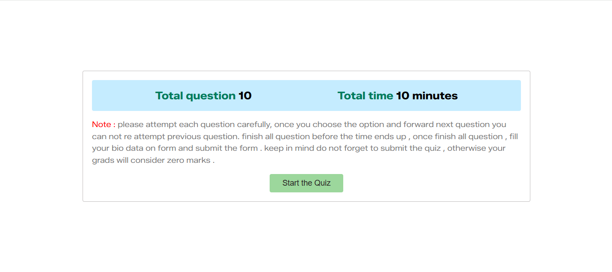
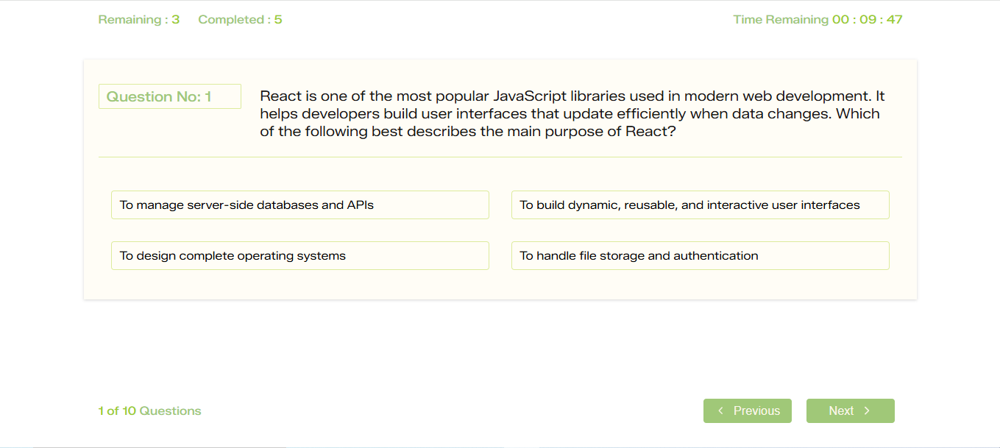
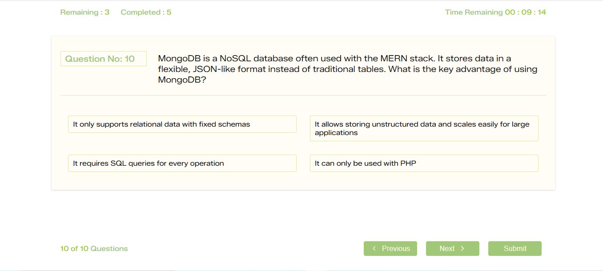
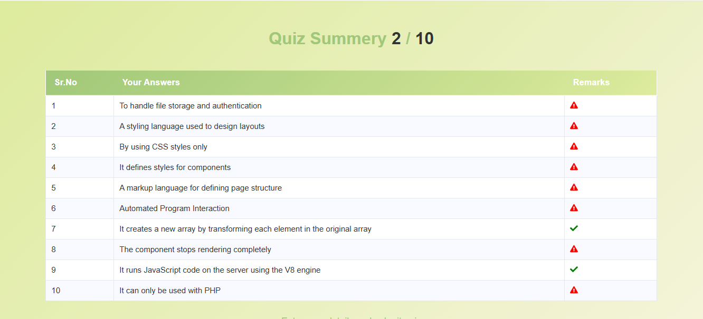

````md
# 🎯 Online Quiz Application

**Online Quiz Application** is a React.js-based interactive quiz platform where users can test their knowledge through multiple-choice questions.  
The app stores quiz progress and scores using **Browser Local Storage**, providing a smooth and persistent user experience without a backend.

---

## screen shots






## Features

- Multiple-choice quiz questions
- Real-time question navigation
- Instant answer validation
- Score calculation and result summary
- Restart quiz functionality
- Persistent quiz data using Local Storage
- Fully responsive UI
- Fast and interactive React interface

---

## Tech Stack

- **Frontend:** React.js
- **State Management:** React Hooks
- **Storage:** Browser Local Storage
- **Styling:** CSS / SCSS

---

## Project Structure

```text
online-quiz-app/
│
├── src/
│   ├── components/
│   ├── data/
│   ├── utils/
│   ├── App.js
│   └── index.js
│
├── public/
├── package.json
└── README.md
```
````

---

## How It Works

- Users answer multiple-choice questions one by one.
- The app tracks selected answers and calculates the score automatically.
- Results are displayed at the end of the quiz.
- Quiz state and results are stored in **localStorage** to maintain session data.

---

## Installation & Setup

1. Clone the repository:

```bash
git clone https://github.com/asifmeer55766/online-quiz-application.git
```

2. Navigate to the project folder:

```bash
cd online-quiz-application
```

3. Install dependencies:

```bash
npm install
```

4. Run the project:

```bash
npm run dev
```

---

## 🌟 Future Enhancements

- Leaderboard system
- Question categories & difficulty levels
- Timer-based quiz mode

---

## Contributing

Feel free to fork this repository and submit pull requests.
All contributions are welcome!

---

## License

This project is licensed under the **MIT License**.

---

## Author

**Asif Hussain**
Frontend Developer | React.js Developer

---

⭐ If you like this project, don’t forget to **star** the repository!
